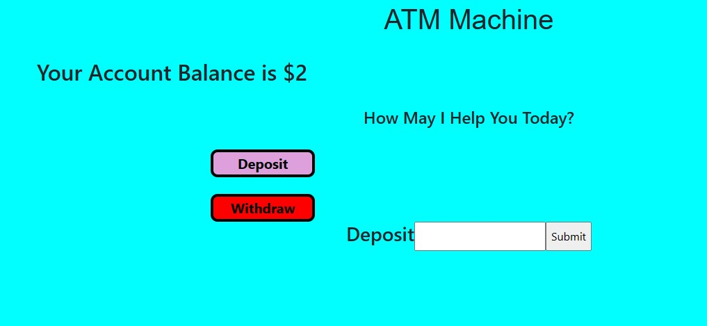

<a href="https://github.com/TennWilliams/ATM"> ATM Exercise </a>
## ATM

In this exercise I created an ATM that displays your account balance and allows you to deposit and withdraw money from your account. It does not allow you to withdraw more money than you have in your account and doesnt allow you to enter zero or a neagative number as an amount,  if you try than you will recieve an error mesaage.  Once you click submit the input box will resset.  I also added hover messages when you hover over the buttons and input box.  I chnaged the color and positions of the two buttons so the user won't easily mistake the two and when you hover over the buttons the color will change and the button will become bold and pop out from its position.

Future improvments to this exercise is to add ATM features like quick withdrawal and a receipt option.

You can run this exercise by cloning it and running it on a local http server.

License through MIT
